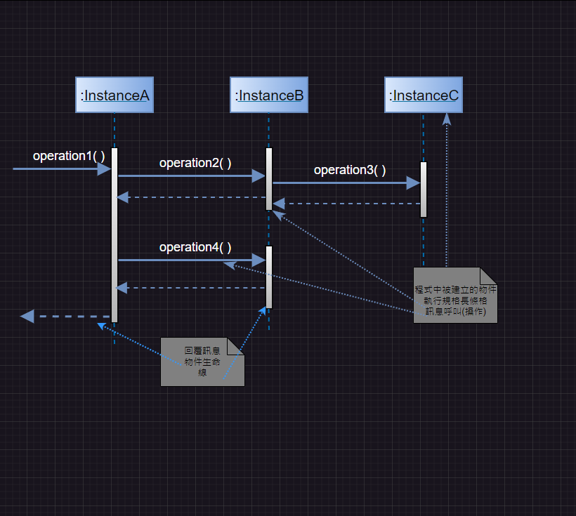

# 第2次隨堂-隨堂-QZ2
>
>學號：111111224
> 
>姓名：邱武昱
> 
>作業撰寫時間：30 (mins，包含程式撰寫時間)
> 
>最後撰寫文件日期：2024/05/22
>

本份文件包含以下主題：(至少需下面兩項，若是有多者可以自行新增)
- [x] 說明內容
- [x] 個人認為完成作業須具備觀念

## 說明程式與內容

## 個人認為完成作業須具備觀念
參與者必須要標示明確，再來使用箭頭來表示參與者之間的訊息傳遞，並清楚各參與者之間的關係，並理解系統的功能和運作方式